```mermaid
graph LR
    SEQ[Sequencer<br/>Gate Out] -->|Gate 🟡| MATHS[Maths<br/>Ch1 Trig In]
    MATHS -->|CV 🔵| VCA[VCA<br/>CV Input]
    VCA -->|Audio 🔴| OUT[Audio Out]
    
    style MATHS fill:#e1f5fe
    style SEQ fill:#f3e5f5
    style VCA fill:#e8f5e8
```

```mermaid
graph TB
    subgraph "Variable Modulation"
        OCHD[DivKid Ochd<br/>⚡ Variable Rate LFOs]
    end
    
    subgraph "Signal Processing"
        MATHS[Make Noise Maths<br/>⚙️ Function Generator]
    end
    
    subgraph "Musical Destinations"
        OSC[Oscillator FM]
        FILT[Filter Cutoff]
        VCA[VCA Control]
        FX[Effects Parameters]
    end
    
    OCHD -->|LFO1 🔵| MATHS
    OCHD -->|LFO3 🔵| MATHS  
    OCHD -->|LFO7 🔵| MATHS
    
    MATHS -->|Processed CV 🔵| OSC
    MATHS -->|Processed CV 🔵| FILT
    MATHS -->|Processed CV 🔵| VCA
    MATHS -->|Processed CV 🔵| FX
    
    style OCHD fill:#c8e6c9
    style MATHS fill:#e1f5fe
    style OSC fill:#fff3e0
    style FILT fill:#f3e5f5
    style VCA fill:#e8f5e8
    style FX fill:#fce4ec
```

# Make Noise Maths - Guide
*The Swiss Army Knife of Eurorack*

---


*Make Noise Maths - Four-channel analog computer showing Rise/Fall controls, attenuverters, and comprehensive CV/trigger inputs for mathematical processing*

---

## What This Unlocks From Your Existing Gear

### **CV Controllers & Performance Gear:**
- **Expression pedals** - Any expression pedal becomes a macro control source for multiple Maths parameters
- **MIDI controllers with CV** - Keyboard aftertouch, mod wheels, sliders control mathematical relationships
- **Eurorack CV sources** - Existing LFOs, envelopes, sequencers become Maths processing inputs
- **Analog synthesizers** - Vintage synth CV outputs processed through mathematical relationships
- **Performance controllers** - Ribbon controllers, theremins, motion sensors drive mathematical computation

### **Studio & Audio Equipment:**
- **Mixing consoles** - Use Maths as macro control hub for complex console automation
- **Audio interfaces** - Multiple outputs can control interface parameters through CV-to-MIDI conversion
- **Outboard processors** - Maths controls hardware compressors, EQs, effects via CV automation
- **Studio monitors** - Mathematical relationships control monitoring levels and routing
- **Recording equipment** - Automate recording parameters through mathematical CV relationships

### **Existing Synthesizers:**
- **Analog monosynths** - Maths processes and enhances existing synthesizer modulation capabilities
- **Vintage polysynths** - Individual voice outputs processed through mathematical relationships
- **Drum machines** - Trigger outputs become mathematical timing sources, individual outs processed
- **Grooveboxes** - CV outputs enhanced through Maths mathematical processing
- **Modular systems** - Existing modules gain mathematical processing and macro control capabilities

### **Educational & Analysis Tools:**
- **Oscilloscopes** - Visualize mathematical relationships and envelope shapes in real-time
- **Educational equipment** - Demonstrate analog computation and mathematical synthesis concepts
- **Test equipment** - Precise voltage sources for calibration and mathematical verification
- **Laboratory instruments** - Function generators become musical mathematical sources

### **Creative & Experimental Gear:**
- **Contact microphones** - Physical gestures become mathematical control sources
- **Light sensors** - Environmental changes drive mathematical relationships
- **Pressure sensors** - Physical interaction controls mathematical computation
- **DIY controllers** - Any voltage source becomes part of mathematical music system
- **Found electronics** - Circuit-bent devices processed through mathematical relationships

**Discovery moment:** Your entire creative setup suddenly becomes a unified mathematical music system - every controller, every synthesizer, every audio tool can contribute to complex mathematical relationships that create music impossible to achieve with any single device.

---

## Quick Start: Get Your First Sound in 5 Minutes

**What is Maths?** Think of it as four powerful tools in one module: two envelope generators, two offset generators, and a mixer that can combine them all.

**Key Specifications:**
- **Width:** 20 HP
- **Depth:** 38 mm
- **Power:** 90 mA @ +12V / 90 mA @ -12V / 0 mA @ +5V

### Your First Envelope (Channel 1)
1. **Patch a trigger/gate** → Channel 1 **TRIG** input (top left)
2. **Turn Rise and Fall knobs** to 12 o'clock position  
3. **Patch Channel 1 Unity output** → your VCA CV input
4. **Trigger it!** You should see the LED light up and hear your envelope working

**Congratulations!** You just made Maths work as an envelope generator.

---

## Essential Parameters (The Big 4)

### **1. Rise Time** 
- **What it does:** Controls how fast the envelope goes UP
- **Musical result:** Attack time - fast = snappy drums, slow = swells
- **Range:** Instant to 25 minutes(!!)

### **2. Fall Time**
- **What it does:** Controls how fast the envelope goes DOWN  
- **Musical result:** Release/decay time - fast = plucks, slow = fade-outs
- **Range:** Instant to 25 minutes

### **3. Cycle Button**
- **What it does:** Makes the envelope repeat automatically = LFO
- **Musical result:** Press it and your envelope becomes a wobbling LFO
- **Try this:** Press cycle, turn Rise/Fall to different positions, patch to filter cutoff

### **4. Attenuverters (Center Knobs)**
- **What they do:** Control the strength and direction of each channel
- **12 o'clock = no effect**, **clockwise = positive**, **counter-clockwise = negative/inverted**

---

## Understanding Analog Computation: What Maths Actually Does

**Maths is not a digital envelope generator.** It's an analog computer—a circuit that performs mathematical operations on electrical voltage in real-time, with zero latency and infinite resolution.

This distinction matters. Digital envelopes calculate envelope shapes and output them as a stream of numbers. Analog envelopes *are electrical processes*—voltage building and falling according to physical laws.

### **The Mathematical Heart: Integration**

Rise and Fall controls don't just "shape" envelopes. They control **integration**—a core mathematical operation where voltage *accumulates over time*.

When you turn a Rise knob:
1. You apply a constant current to a capacitor
2. The capacitor charges at a rate determined by that current
3. The voltage rises *smoothly and continuously*
4. The output at any moment depends on how long the charging has been happening

This is why Rise and Fall can range from microseconds to 25 minutes—you're literally controlling how fast electricity fills a capacitor. There's no quantization, no sample rate, no digital rounding. Just physics.

**Musical consequence:** Maths envelopes *feel* different because they're not approximations of mathematical curves—they *are* mathematical curves, generated by analog physics.

### **Thinking in Voltage: The Core Language**

Maths operates in the universal language of modular synthesis: voltage as information.

- **0V = the reference point** (nothing happening)
- **+5V = positive control** (filter opens, amp increases, pitch rises)
- **-5V = negative control** (filter closes, amp decreases, pitch falls)
- **All voltages between = proportional effects**

When you patch a signal into Maths Signal Input, you're not uploading data—you're connecting a continuously varying electrical signal that Maths *reads and transforms in real-time*.

The attenuverter at 12 o'clock = zero voltage passing through (no effect). Turn it clockwise and you're *amplifying* that signal. Turn it counter-clockwise and you're *inverting* it—flipping the polarity so that what goes up comes down.

This is why the attenuverter is not a "volume knob"—it's a **multiplier** that scales voltage relationships.

### **The Hidden Utility: Voltage Addition (SUM)**

Understanding analog computation reveals Maths' most powerful hidden feature: the SUM output automatically adds voltages together.

If you patch four different sources into Maths channels and turn on all four attenuverters:
- Ch1 Variable = +2V
- Ch2 Variable = +1V  
- Ch3 Variable = -3V
- Ch4 Variable = +4V
- **SUM Output = +4V** (2+1-3+4 = 4)

This isn't a "mixing feature" bolted on—it's the fundamental nature of analog circuits. Voltages naturally add together when they meet at a summing point. Maths exposes this as a feature.

**Musical consequence:** You can design patches where the mathematical relationship of four independent modulation sources creates entirely new control voltages that none of the sources produced alone.

### **The Hidden Utility: Internal Voltage References**

Channels 2 and 3 have a subtle superpower: when nothing is patched to the Signal input, they *generate* +10V internally.

Why +10V? Because in Eurorack, 1V per octave is the pitch standard. +10V = 10 octaves above reference. With the attenuverter at 12 o'clock, this internal voltage does nothing. But turn the attenuverter to +50% and you've created a fixed +5V offset—a constant voltage that can transpose any sequence without external patching.

Make Noise didn't add a "reference voltage generator"—they designed channels 2 and 3 so that the absence of a patch becomes *a feature*, not a missing cable.

**Musical consequence:** You can perform complex voltage mathematics entirely within Maths, using no external CV sources—just the module's own internal circuitry and your knowledge of how to combine things.

### **Why This Design Philosophy?**

Maths embodies a specific teaching obligation: **show musicians how synthesis actually works at the electrical level**.

A typical envelope generator hides its internals. Press the Attack knob and "something happens." Maths reveals the architecture: "You're charging a capacitor. This is integration. This is how all time-based modulation works."

Every time you use Maths, you're learning about:
- How voltage represents information
- How analog circuits perform mathematical operations  
- How modular synthesis connects everything through continuous signals
- How one excellent design can replace dozens of single-purpose modules

This is why Maths is educational beyond "how to use it." Every patch teaches you something about *how synthesis thinks*.

---

## Historical Context: Why Everyone Has One

Maths arrived at a crucial moment in modular synthesis: when DIY culture and Eurorack were expanding beyond specialists and into the hands of musicians who needed to *understand* what was happening, not just use it.

Before Maths, you needed separate modules for envelopes, LFOs, mixers, and slew limiters. Maths unified them into one design that revealed *how they were all the same thing*—different applications of the same analog mathematical principle: voltage integration. This wasn't just space-efficient; it was philosophically revolutionary. It taught that synthesis is fundamentally about voltage relationships, not isolated features.

The module became a standard—arguably *the* standard teaching tool for analog synthesis. If you wanted to learn modular, you learned Maths. If you built a small system, Maths was non-negotiable. Within the Eurorack community, owning Maths became as foundational as owning a VCA or a filter. It's difficult to find an intermediate or advanced modular synthesizer that doesn't include one.

Why? Because Maths does something almost no other module does: **it teaches you that everything in modular synthesis is fundamentally the same thing**—voltage, time, and mathematical relationships. Once you understand Maths, you understand the entire language of modular synthesis. Every other module becomes a different application of the same principles.

This design philosophy connects directly to the interconnection principle: Maths doesn't exist in isolation. It's the hub through which all other modules speak to each other in the universal language of voltage mathematics. You can't build a sophisticated modular system without understanding how to think like Maths does.

Twenty years of consistency, countless documentation efforts, and the fact that it *still* doesn't have a serious competitor speaks to something rare: a design so fundamentally correct that it becomes transparent. Musicians don't think about whether to use Maths—they think about how. It's the language through which synthesis literacy is transmitted across generations.

---

## Design Reasoning: Why Each Feature Exists

Every choice Make Noise made for Maths serves a teaching purpose. Understanding the *why* reveals how intentional this design is.

### **Dual Trigger Types (Signal vs. Trigger Inputs)**

Most modules have one envelope input. Maths has two different ones:
- **Trigger Input** - Always completes its full Rise/Fall cycle, regardless of gate length
- **Signal Input** - Envelope follows the gate length, sustaining while the gate is high

Make Noise included both because they teach different things.

**Trigger Input teaches:** Envelopes have their own timing independent of the gate. You *trigger* a process that unfolds according to its own Rise/Fall settings. This reveals that an envelope is fundamentally a **time-based computation**—it needs a start point and then does its own thing.

**Signal Input teaches:** Envelopes can also follow external control. The gate becomes the modulation source itself—the envelope *tracks* the input. This reveals that Maths channels are flexible: they can be driven by timing or by direct control.

Most musicians will use Trigger Input for drums and percussion (fixed timing) and Signal Input for modulation processing (responsive to external control). This single design choice teaches the entire concept of gate-driven vs. signal-driven modulation.

### **Normalization (Channels 2 & 3 Generate +10V)**

When you don't patch anything into a Maths channel, most modules would just sit idle. Channels 2 and 3 do something different: they generate +10V internally.

Why not make it the user's responsibility to patch a constant voltage source?

Because **normals teach that absence can be a feature, not a missing cable.** Make Noise is saying: "When you don't patch anything, we automatically provide a useful reference voltage. You can then scale it with the attenuverter."

This single design choice reveals several synthesis principles:
- Voltage references are fundamental to how modular works
- 1V/octave is the universal pitch standard (so +10V is meaningful)
- Attenuverters can create complex relationships from simple internal references
- You don't need external sources to perform mathematics

Every musician who learns Maths by not patching a Signal input and using the internal +10V learns something crucial: **modular systems contain infinite possibilities when you understand the voltage math built into them.**

### **Attenuverter Design (12 O'Clock = OFF, Not Maximum)**

Most knobs work this way: minimum at 7 o'clock, maximum at 5 o'clock, with the midpoint somewhere in between. Maths attenuverters work differently:
- **12 o'clock = 0% (off, no effect)**
- **Clockwise = positive scaling (0% to +100%)**
- **Counter-clockwise = negative scaling (0% to -100%)**

This is unconventional. Why?

Because it teaches **inversion as a core synthesis concept.** By making "off" the center point, Make Noise forces you to think about direction. When you turn an attenuverter clockwise, you're explicitly choosing to amplify positively. When you turn it counter-clockwise, you're explicitly choosing to invert.

This is not just a UI preference. It teaches that modular synthesis is fundamentally about **polarity and direction of control**, not just quantity. A negative scaling of your LFO creates entirely different musical behavior than positive scaling—not just different amounts, but different *directions*.

Every patch where you've used an attenuverter teaches you to think about the mathematical sign of your modulation, not just its magnitude.

### **Automatic Summing (SUM Output)**

Maths Variable outputs automatically combine at the SUM output without patching. This seems like a small convenience feature, but it's actually teaching **how analog circuits naturally work.**

In real analog circuitry, when two voltage sources meet at a node, they naturally add together. Make Noise exposed this fundamental principle as a feature instead of hiding it in circuit internals.

**Teaching moment:** The first time you hear Ch1 + Ch2 + Ch3 combining at SUM and creating something none of them produced alone, you've learned that **modular synthesis creates new possibilities through combination.** This is the interconnection principle made tangible. You're not just patching modules; you're creating mathematical relationships that didn't exist before.

### **Cycle Button (Instant Envelope-to-LFO Transformation)**

The Cycle button does something simple: makes the envelope repeat automatically. But why expose this as a single physical button?

Because it teaches that **envelopes and LFOs are the same thing**, just running at different speeds and with different repeat behavior.

Most musicians learn this eventually through reading and theory. With Maths, you learn it by pressing a button and hearing your envelope become a wobble. Rise and Fall suddenly change meaning—they become speed controls instead of timing controls. The same knobs do completely different things depending on whether you press Cycle.

**Teaching moment:** This single button reveals that in synthesis, categories like "envelope" and "LFO" are not fixed types—they're just different applications of the same voltage generation principle.

### **Four Channels (Optimal Complexity)**

Why four channels? Why not three? Why not five?

Four is the sweet spot where:
- You can handle most real-world patching situations (4 envelopes, 4 modulation sources, mixing operations)
- Complexity remains manageable for learning (unlike 8+ channel modules)
- The SUM output becomes genuinely useful (combining 4 independent things creates meaningful new possibilities)
- You can still understand the whole circuit architecture

Make Noise could have made Maths bigger. Instead, they designed it to be **completely understandable**. When you grasp all four channels, you're not just using a tool—you've learned the foundational principles of analog computation as applied to music.

### **20HP Size (Exactly Right)**

Twenty Eurorack units is large enough for:
- Four independent channels with clear panel layout
- Readable labels and reasonable knob spacing
- Easy-to-see LEDs and connections
- Room for internal circuitry that does real work

But small enough that:
- It fits in small systems without dominating
- The entire circuit architecture is graspable (not hidden behind overwhelming complexity)
- It becomes a standard building block, not a rare specialist tool

**Teaching moment:** The physical size encodes a teaching principle. Maths is big enough to be powerful but small enough to be understood. It occupies exactly the design space needed to teach synthesis without overwhelming.

---

## Beginner Patch Ideas

**These four patches teach progression: Basic → Intermediate → Advanced → Expert. Each teaches core principles that build on the previous.**

### **Patch 1: Basic - Classic Envelope Generator**

**What it teaches:** Envelopes are triggered events with their own timing (Rise/Fall), independent of gate length.

**Mermaid Diagram:**


**ASCII Alternative:**
```
🔴 Audio │ 🔵 CV │ 🟡 Gate

┌─Sequencer─┐    ┌─────Maths─────┐    ┌─VCA──┐    ┌─Output─┐
│ Gate ○────┼────┼─▶ Ch1 Trig    │    │      │    │       │
│           │    │               │    │      │    │       │
│           │    │ Ch1 Unity ○───┼────┼─▶CV  │    │       │
│           │    │               │    │   ║  │    │       │
└───────────┘    └───────────────┘    │ Audio◀────┼───────│ 🔴
                                       │   ║  │    │       │
                                       │ Out ○─────┼─▶ Out │
                                       │     ║     │       │
                                       └─────║─────┘       │
                                             ║             │
                                      CV (Blue)            │
                                                           🔴
```

| Connection | Cable Type | Notes |
|------------|------------|-------|
| Sequencer Gate → Maths Ch1 TRIG | Gate (Yellow) | Triggers envelope on each step |
| Maths Ch1 UNITY → VCA CV In | CV (Blue) | Controls amplitude |

**Module Settings:**
- **Maths:** Rise knob at 12 o'clock, Fall knob at 12 o'clock
- **Cycle button:** OFF (unpressed)
- **Ch1 Attenuverter:** 12 o'clock (unity gain)

**Result:** Classic attack/decay envelope - adjust Rise for punch, Fall for tail

**Main Example:** Make Noise Maths Ch1 → VCA CV (ADSR-style envelope)
**Alternative Options:**
- **Budget:** Doepfer A-140-2, Erica Synths Pico EG
- **Different character:** Intellijel Quadrax complex functions, Joranalogue Contour 1 west coast
- **Premium:** Serge DUSG, Buchla 281t quad function generator

---

### **Patch 2: Intermediate - Organic Mathematical Processing**

**What it teaches:** Maths processes other CV sources (not just triggers). Each channel can shape and transform modulation.

**Mermaid Diagram:**


```mermaid
graph TB
    subgraph "Modulation Source"
        OCHD[DivKid Ochd<br/>Variable LFOs]
    end
    
    subgraph "Mathematical Processing"
        MATHS[Make Noise Maths<br/>Four Channels]
    end
    
    subgraph "Musical Destinations"
        FILT[Filter Cutoff]
        OSC[Oscillator]
        VCA[VCA Control]
    end
    
    OCHD -->|LFO1, LFO3, LFO7 🔵| MATHS
    MATHS -->|Processed CV 🔵| FILT
    MATHS -->|Processed CV 🔵| OSC
    MATHS -->|Processed CV 🔵| VCA
    
    style OCHD fill:#c8e6c9
    style MATHS fill:#e1f5fe
    style FILT fill:#f3e5f5
    style OSC fill:#fff3e0
    style VCA fill:#e8f5e8
```

| Module Integration | Signal Flow | What You Learn |
|-------------------|-------------|----------------|
| **Ochd LFO 1 → Maths Ch1** | Organic CV input | Envelopes follow CV, not just triggers |
| **Ochd LFO 3 → Maths Ch4** | Different timing | Multiple channels process independent sources |
| **Ochd LFO 7 → Maths SUM** | Combined influence | Attenuverters create mathematical relationships |
| **Maths outputs → destinations** | Processed modulation | One source becomes multiple controlled effects |

**Module Settings:**
- **Ochd:** Three LFOs at different rates (12 o'clock, 1 o'clock, 2 o'clock)
- **Maths Ch1:** Rise/Fall set to smooth out fast LFO transitions
- **Maths Ch4:** Slower Rise/Fall for deeper modulation
- **Attenuverters:** Start at 12 o'clock (off), then explore turning them clockwise for positive effect

**Result:** Ochd's organic breathing becomes mathematically processed → smooth, complex modulation of multiple parameters

**Main Example:** DivKid Ochd LFOs → Make Noise Maths → Multiple destinations
**Alternative Options:**
- **Budget:** Make Noise Maths + 2hp LFO
- **Different character:** Batumi geometric patterns, Pamela's New Workout
- **Premium:** Verbos Harmonic Oscillator, Serge slopes

---

### **Patch 3: Advanced - Macro Control Hub for Production**

**What it teaches:** Mathematical relationships between controls. Inverse scaling (one parameter up while another goes down). Production-focused thinking.

**ASCII Diagram:**
```
🔴 Audio │ 🔵 CV │ 🟡 Gate

    One Control (Sequencer/Expression)
              │
              ▼
    ┌──────────────────┐
    │   Maths Macro    │
    │ (Four Independent │    Filter Cutoff:   +80%  (gets brighter)
    │  Attenuverters)  │    Filter Resonance: -60% (gets tamer)
    │                  │    Oscillator FM:    +40% (adds harmonics)
    │  Ch1, Ch2,       │    Reverb Send:      +90% (more space)
    │  Ch3, Ch4        │
    │  Variables       │
    └──────────────────┘
              │
         Four Separate
      Mathematical Outputs
```

**Key Teaching:** Inverse relationships. When one macro control moves, different parameters respond differently—some amplify, some invert.

| Parameter | Attenuverter | Effect | Why It Matters |
|-----------|-------------|--------|----------------|
| Filter Cutoff | +80% | Opens up | Brightens with intensity |
| Filter Resonance | -60% | Closes down | Prevents harshness |
| Oscillator FM | +40% | Moderate increase | Adds complexity gradually |
| Reverb Send | +90% | Strong increase | Creates dramatic space |

**Module Settings:**
- **All Signal inputs:** Connected to same CV source (sequencer or expression pedal via mult)
- **Each attenuverter:** Set to specified value
- **Attenuverter math:** Positive amplifies the signal, negative inverts it (12 o'clock = off)

**Result:** One control shapes four different parameters in mathematically related ways. SUM output shows combined effect.

**Main Example:** Single CV source → Maths (four channels with mathematical relationships) → Four sonic parameters
**Alternative Options:**
- **Budget:** Doepfer A-143-3 + mixer
- **Different character:** Intellijel Scales, 4ms RCD
- **Premium:** Buchla 257e voltage processor

---

### **Patch 4: Expert - Complete Mathematical Ecosystem**

**What it teaches:** Maths as a central computational hub. Multiple intelligence types (organic, chaotic, algorithmic, synthesis) combined through mathematical processing. Emergent behavior from combination.

**System Overview:**


**What Happens:**
- Each module type (organic, chaos, algorithmic, synthesis) produces its own "intelligence"
- Maths receives all four simultaneously
- Each channel processes one type of intelligence
- SUM output combines them all
- Result: Emergent musical behavior that none of the modules could produce alone

**Learning Objectives:**
1. **Maths as system architect** - It doesn't just process; it combines different types of thinking
2. **Mathematical emergence** - Four separate things combine into something new
3. **Interconnection principle** - Everything relates to everything else through voltage math
4. **System consciousness** - Patch becomes "alive" with layered intelligence types

**Expert Technique:**
- Each Maths channel handles one intelligence type
- Attenuverters scaled to complement (not overwhelm) each type
- Feedback loops optional (advanced performance)
- Entire ecosystem "breathes" together

**Main Example:** Ochd + Wogglebug + Marbles + Plaits → Maths processing → Unified musical system
**Alternative Options:**
- **Budget:** Subsets of this (Ochd + Marbles + Maths)
- **Different character:** Wogglebug + Marbles (chaos + algorithm)
- **Premium:** Verbos collection, Buchla ecosystem

---

## Advanced Techniques

**Mermaid Diagram:**


**ASCII Alternative:**
```
🔴 Audio │ 🔵 CV │ 🟡 Gate

┌─Sequencer─┐    ┌─────Maths─────┐    ┌─VCA──┐    ┌─Output─┐
│ Gate ○────┼────┼─▶ Ch1 Trig    │    │      │    │       │
│           │    │               │    │      │    │       │
│           │    │ Ch1 Unity ○───┼────┼─▶CV  │    │       │
│           │    │               │    │   ║  │    │       │
└───────────┘    └───────────────┘    │ Audio◀────┼───────│ 🔴
                                       │   ║  │    │       │
                                       │ Out ○─────┼─▶ Out │
                                       │     ║     │       │
                                       └─────║─────┘       │
                                             ║             │
                                      CV (Blue)            │
                                                           🔴
```

| Connection | Cable Type | Notes |
|------------|------------|-------|
| Sequencer Gate → Maths Ch1 TRIG | Gate (Yellow) | Triggers envelope on each step |
| Maths Ch1 UNITY → VCA CV In | CV (Blue) | Controls amplitude |

**Module Settings:**
- **Maths:** Rise knob at 12 o'clock, Fall knob at 12 o'clock
- **Cycle button:** OFF (unpressed)
- **Ch1 Attenuverter:** 12 o'clock (unity gain)

**Visual Feedback:**
- **Ch1 Unity LED:** Flashes green when triggered, brightness follows envelope
- **Result:** Classic attack/decay envelope - adjust Rise for punch, Fall for tail

**Main Example:** Make Noise Maths Ch1 → VCA CV (classic ADSR-style envelope control)
**Alternative Options:**
- **Budget:** Doepfer A-140-2, Erica Synths Pico EG
- **Different character:** Intellijel Quadrax complex functions, Joranalogue Contour 1 west coast
- **Premium:** Serge DUSG, Buchla 281t quad function generator

### **Patch 2: Intermediate - Advanced Organic Mathematical Processing**

**Mermaid Diagram:**


**ASCII Alternative:**
```
🔴 Audio │ 🔵 CV │ 🟡 Gate

   ┌─────────────────────┐      ┌─────────────────────┐
   │   DivKid Ochd      │      │   Make Noise Maths  │
   │   (Advanced)       │      │   (Foundation)      │
   │                    │      │                     │
   │ LFO 1 ○────────────┼──────┼─▶ Ch1 Signal Input  │
   │       ║            │      │                     │
   │ LFO 3 ○────────────┼──────┼─▶ Ch4 Signal Input  │
   │       ║            │      │                     │
   │ LFO 7 ○────────────┼──────┼─▶ SUM CV Input      │
   │       ║            │      │                     │
   │       ║            │      │ Ch1 Unity Out ○─────┼─── CV (Blue)
   │       ║            │      │                     │
   │       ║            │      │ Ch4 Variable Out○───┼─── CV (Blue)
   │       ║            │      │                     │
   │       ║            │      │ SUM Output ○────────┼─── CV (Blue)
   └───────║────────────┘      └─────────────────────┘
           ║                           ║      ║    ║
   CV (Blue)║                   CV (Blue)║      ║    ║
           ▼                           ║      ║    ║
   ┌─────────────┐                    ▼      ▼    ▼
   │   Filter    │           ┌──────────────────────────┐
   │             │           │    Multiple Destinations │
   │ Cutoff CV◀──┼───────────┼─ Oscillator FM           │
   │             │           │ Filter Resonance         │
   │ Audio In ◀──┼───────────┼─ VCA CV                  │
   │             │           │ Effects Parameters       │
   │ Audio Out○──┼───────────┼─                        │
   └─────────────┘           │ Organic System ○────────┼─── Breathing Music
                             └──────────────────────────┘
```

| Module Integration | Signal Flow | Purpose | Advanced Synergy |
|-------------------|-------------|---------|------------------|
| **Ochd LFO 1 → Maths Ch1** | Organic modulation | **Breathing envelope control** | **Organic timing processing** |
| **Ochd LFO 3 → Maths Ch4** | Mid-speed organic CV | **Parameter drift control** | **Natural parameter evolution** |
| **Ochd LFO 7 → SUM Input** | Slow organic drift | **System-wide organic influence** | **Long-term musical breathing** |
| **Maths Processing** | Mathematical shaping | **Organic + Mathematical hybrid** | **Best of both worlds** |

**Module Settings:**
- **Ochd Rate:** 12 o'clock for musical organic timing
- **Maths Ch1:** Rise/Fall set for envelope processing of organic signals
- **Maths Ch4:** Used as slew processor for smooth organic transitions
- **SUM:** Combines all organic + mathematical relationships

**Learning Objectives:**
- **Foundation + Advanced integration:** Mathematical processing of organic modulation
- **Hybrid modulation:** Combine organic breathing with precise mathematical control
- **System breathing:** Entire patch breathes with organic life
- **Advanced modulation routing:** Complex relationships between modules

**Main Example:** Make Noise Maths + DivKid Ochd → Multiple destinations (organic mathematical processing)
**Alternative Options:**
- **Budget:** Make Noise Maths + 2hp LFO, Doepfer A-143-3 quad LFO
- **Different character:** Make Noise Maths + Batumi geometric patterns, Pamela's New Workout clocked LFOs
- **Premium:** Make Noise Maths + Verbos Harmonic Oscillator, Serge VCFS slopes
```
                   ┌──────────────┐    ┌─────────────┐
    [CYCLE ON] ───▶│    Maths     │───▶│   Filter    │
                   │ Ch1 CYCLE ●  │    │ Cutoff CV   │
                   │              │    └─────────────┘
                   │ Ch1 UNITY OUT│           ▲
                   │   [LED ◐]    │           │
                   └──────────────┘           │
                                              │
    ┌─────────────┐                         │
    │Oscillator   │─────Audio──────────────┘
    │(Audio Out)  │
    └─────────────┘
```

| Connection | Cable Type | Notes |
|------------|------------|-------|
| Oscillator Audio → Filter Audio In | Audio (Red) | Main signal path |
| Maths Ch1 UNITY → Filter CV In | CV (Blue) | Modulates cutoff frequency |

**Module Settings:**
- **Maths:** Cycle button PRESSED (LED lit), Rise/Fall at 10-2 o'clock range
- **Ch1 Attenuverter:** Adjust for desired filter sweep depth
- **Filter:** Resonance low, cutoff around center for best sweep range

**Visual Feedback:**
- **Ch1 Unity LED:** Pulses continuously green/red showing LFO wave
- **Cycle LED:** Stays lit indicating continuous operation
- **Result:** Automatic filter sweeps - faster Rise/Fall = faster wobble

**Main Example:** Make Noise Maths Ch1 Cycle → Filter CV (automatic LFO filter sweeps)
**Alternative Options:**
- **Budget:** 2hp LFO, Doepfer A-145 LFO
- **Different character:** Batumi quadrature LFO, Tides LFO mode with different waveforms
- **Premium:** Verbos Harmonic Oscillator LFO, Serge NTO complex waveforms

### **Patch 3: Expert - AI Integration with Advanced Marbles**
```
   ┌─────────────────────┐      ┌─────────────────────┐
   │   Mutable Marbles   │      │   Make Noise Maths  │
   │    (Advanced)       │      │   (Foundation)      │
   │                     │      │                     │
   │ X1 Out ○────────────┼──────┼─▶ Ch1 Signal Input  │
   │                     │      │                     │
   │ X2 Out ○────────────┼──────┼─▶ Ch4 Signal Input  │
   │                     │      │                     │
   │ t1 Out ○────────────┼──────┼─▶ Ch1 Trigger       │
   │                     │      │                     │
   │ Y Out  ○────────────┼──────┼─▶ Attenuverter 3    │
   │                     │      │                     │
   │ DEJA VU CV      ◀───┼──────┼─ SUM Output         │
   │ (Learning Loop)     │      │                     │
   │                     │      │ Ch1 Unity Out ○─────┼─── CV (Blue)
   │ External Processing │      │                     │
   │ Mode: ON            │      │ Ch4 Variable Out○───┼─── CV (Blue)
   │                     │      │                     │
   │ STEPS: 2 o'clock    │      │ OR Output ○─────────┼─── CV (Blue)
   │ (Musical quantization)      │                     │
   └─────────────────────┘      │ AND Output ○────────┼─── Gate (Yellow)
                                └─────────────────────┘
                                         ║      ║    ║    ║
                                 CV (Blue)║      ║    ║    ║ Gate
                                         ▼      ▼    ▼    ▼ (Yellow)
                                ┌─────────────────────────────────┐
                                │    Complex Synthesis Network     │
                                │                                 │
                                │ Oscillator 1V/Oct  ◀─ Ch1 Unity│
                                │ Filter Cutoff      ◀─ Ch4 Var  │
                                │ VCA CV             ◀─ OR Output │
                                │ Clock Input        ◀─ AND Output│
                                │                                 │
                                │ AI + Mathematical Music ○──────┼─── Intelligent Output
                                └─────────────────────────────────┘
```

| AI + Mathematical Chain | Function | Purpose | Advanced Integration |
|------------------------|----------|---------|---------------------|
| **Marbles X1,X2 → Maths Ch1,Ch4** | AI voltage processing | **Intelligent envelope shaping** | **AI learns mathematical relationships** |
| **Marbles t1 → Ch1 Trigger** | AI timing | **Musical trigger processing** | **Intelligent timing becomes envelopes** |
| **Marbles Y → Attenuverter 3** | AI smooth modulation | **Meta-modulation control** | **AI controls mathematical mixing** |
| **SUM → DEJA VU CV** | Learning feedback | **System learns math** | **AI learns from mathematical output** |

**Module Settings:**
- **Marbles:** External Processing ON, learns from mathematical output
- **Maths:** Processes AI intelligence through analog mathematical computation
- **Feedback Loop:** SUM output teaches Marbles about mathematical relationships
- **Result:** AI + Mathematics = Increasingly sophisticated musical intelligence

**Learning Objectives:**
- **AI + Mathematical integration:** Artificial intelligence learns mathematical relationships
- **Recursive learning:** System teaches itself through feedback
- **Analog computation of AI:** Mathematical processing of artificial intelligence
- **Meta-musical systems:** Systems that learn to learn

**Main Example:** Make Noise Maths + Mutable Marbles → Feedback learning (AI mathematical processing)
**Alternative Options:**
- **Budget:** Make Noise Maths + Turing Machine, Ornament & Crime random algorithms
- **Different character:** Make Noise Maths + Make Noise Wogglebug chaos, Benjolin feedback systems
- **Premium:** Make Noise Maths + Buchla Source of Uncertainty, Serge random voltage

```mermaid
graph TB
    SEQ[Sequencer<br/>CV Out] -->|CV 🔵| MULT[Mult/Mixer]
    MULT -->|CV 🔵| OSC[Oscillator<br/>V/Oct Input]
    
    MATHS[Maths Ch2<br/>+10V Internal] -->|Offset CV 🔵| MULT
    
    style MATHS fill:#e1f5fe
    style SEQ fill:#f3e5f5
    style OSC fill:#fff3e0
    style MULT fill:#f1f8e9
```


| Connection | Cable Type | Notes |
|------------|------------|-------|
| Sequencer CV → Mult Input | CV (Blue) | Main pitch sequence |
| Mult Out 1 → Oscillator V/OCT | CV (Blue) | Normal pitch tracking |
| Maths Ch2 VARIABLE → Mult Input | CV (Blue) | Offset voltage for transposition |

**Module Settings:**
- **Maths:** Ch2 Signal input EMPTY (uses internal +10V reference)
- **Ch2 Attenuverter:** Clockwise = up transpose, Counter-clockwise = down
- **No Rise/Fall controls** needed for Channel 2 (it's not an envelope)

**Visual Feedback:**
- **Ch2 Variable LED:** Steady green (positive) or red (negative) showing offset
- **Result:** Transpose entire sequence up or down without changing intervals

**Main Example:** Make Noise Maths Ch2 Variable + Sequencer → Oscillator V/Oct (sequence transposition)
**Alternative Options:**
- **Budget:** Doepfer A-138s mixer, 2hp Offset
- **Different character:** Intellijel Scales quantized transposition, Ornament & Crime SH-4 quantizer
- **Premium:** Serge Precision Adder, Buchla 257e voltage processor

### **Patch 4: Expert - Complete Mathematical Ecosystem**

**Mermaid System Overview:**


**Detailed Signal Flow (Mermaid):**


**Detailed CV Routing (Technical Implementation):**

### **Patch 4: Mermaid Test


**Complete System Integration:** 

| Layer | Function | Maths Role | Musical Results |
|-------|----------|------------|----------------|
| **Organic (Ochd)** | Natural breathing | **Channels 1,3 processing** | **Mathematical breathing** |
| **Chaos (Wogglebug)** | Controlled uncertainty | **CV mixing and offset** | **Mathematical chaos** |
| **AI (Marbles)** | Learning intelligence | **Channels 2,4 processing** | **Mathematical AI** |
| **Synthesis (Plaits)** | Sound generation | **Output distribution** | **Mathematical sound** |
| **Mathematical (Maths)** | Central computation | **System brain** | **Unified intelligence** |

**Expert System Design:**
- **Maths as central brain:** All intelligence types processed through mathematical computation
- **Four-channel processing:** Each channel handles different intelligence type
- **Cross-mixing and feedback:** Complex mathematical relationships between all sources
- **Learning integration:** System learns mathematical relationships through feedback
- **Emergent behavior:** Mathematical processing creates new musical behaviors

**Advanced Performance:**
1. **Initialization:** Each module establishes its character
2. **Mathematical integration:** Maths begins processing all intelligence types
3. **Cross-learning:** Modules learn from mathematical relationships
4. **System evolution:** Entire ecosystem becomes increasingly musical
5. **Mathematical transcendence:** Pure mathematical music emerges

**Philosophical Achievement:**
This represents **mathematical consciousness in music** - where organic breathing, controlled chaos, artificial intelligence, and synthesis all become mathematical relationships, processed through analog computation into pure musical intelligence.
```
┌─────────────┐    ┌───────┐    ┌──────────────┐
│ Sequencer   │───▶│ Mult  │───▶│    Maths     │
│ (Gate Out)  │    │       │    │ Ch1 TRIG IN  │
└─────────────┘    └───┬───┘    │              │
                       │        │ Ch4 TRIG IN  │◄─┘
                       └────────│              │
                                │ Ch1 UNITY OUT│──┐
                                │ Ch4 UNITY OUT│──┤
                                │              │  │
                                │  SUM OUTPUT  │◄─┘ ┌─────────────┐
                                │   [LED ◐]   │───▶│   Filter    │
                                └──────────────┘    │ Cutoff CV   │
                                                    └─────────────┘
```

| Connection | Cable Type | Notes |
|------------|------------|-------|
| Sequencer Gate → Mult Input | Gate (Yellow) | Split gate to both channels |
| Mult Out 1 → Maths Ch1 TRIG | Gate (Yellow) | Triggers first envelope |
| Mult Out 2 → Maths Ch4 TRIG | Gate (Yellow) | Triggers second envelope |
| Maths SUM → Filter CV In | CV (Blue) | Combined envelope shapes |

**Module Settings:**
- **Maths Ch1:** Rise FAST (9 o'clock), Fall MEDIUM (1 o'clock), Attenuverter +50%
- **Maths Ch4:** Rise SLOW (3 o'clock), Fall FAST (9 o'clock), Attenuverter +30%
- **Auto-summing:** Unity outputs automatically combine at SUM output

**Visual Feedback:**
- **Ch1 & Ch4 Unity LEDs:** Flash independently showing different envelope shapes
- **SUM LED:** Shows combined result - complex multi-peak envelope
- **Result:** "Shark fin" envelopes perfect for evolving filter sweeps

### **Patch 2: Intermediate - Phase 2 Organic Mathematical Processing**
```
   ┌─────────────────────┐      ┌─────────────────────┐
   │   DivKid Ochd      │      │   Make Noise Maths  │
   │    (Phase 2)       │      │    (Phase 1)        │
   │                    │      │                     │
   │ LFO 1 ○───────────┼──────┼─▶ Ch1 Signal Input  │
   │       ║            │      │                     │
   │ LFO 3 ○───────────┼──────┼─▶ Ch4 Signal Input  │
   │       ║            │      │                     │
   │ LFO 7 ○───────────┼──────┼─▶ SUM CV Input      │
   │       ║            │      │                     │
   │       ║            │      │ Ch1 Unity Out ○─────┼─── CV (Blue)
   │       ║            │      │                     │
   │       ║            │      │ Ch4 Variable Out○──┼─── CV (Blue)
   │       ║            │      │                     │
   │       ║            │      │ SUM Output ○────────┼─── CV (Blue)
   └───────║─────────────┘      └─────────────────────┘
           ║                           ║      ║    ║
   CV (Blue)║                   CV (Blue)║      ║    ║
           ▼                           ║      ║    ║
   ┌─────────────┐                    ▼      ▼    ▼
   │   Filter    │           ┌──────────────────────────┐
   │             │           │    Multiple Destinations │
   │ Cutoff CV◀──┼───────────┼─ Oscillator FM           │
   │             │           │ Filter Resonance         │
   │ Audio In ◀──┼───────────┼─ VCA CV                  │
   │             │           │ Effects Parameters       │
   │ Audio Out○──┼───────────┼─                        │
   └─────────────┘           │ Organic System ○────────┼─── Breathing Music
                             └──────────────────────────┘
```

| Module Integration | Signal Flow | Purpose | Phase 2 Synergy |
|-------------------|-------------|---------|------------------|
| **Ochd LFO 1 → Maths Ch1** | Organic modulation | **Breathing envelope control** | **Organic timing processing** |
| **Ochd LFO 3 → Maths Ch4** | Mid-speed organic CV | **Parameter drift control** | **Natural parameter evolution** |
| **Ochd LFO 7 → SUM Input** | Slow organic drift | **System-wide organic influence** | **Long-term musical breathing** |
| **Maths Processing** | Mathematical shaping | **Organic + Mathematical hybrid** | **Best of both worlds** |

**Module Settings:**
- **Ochd Rate:** 12 o'clock for musical organic timing
- **Maths Ch1:** Rise/Fall set for envelope processing of organic signals
- **Maths Ch4:** Used as slew processor for smooth organic transitions
- **SUM:** Combines all organic + mathematical relationships

**Learning Objectives:**
- **Foundation + Advanced integration:** Mathematical processing of organic modulation
- **Hybrid modulation:** Combine organic breathing with precise mathematical control
- **System breathing:** Entire patch breathes with organic life
- **Advanced modulation routing:** Complex relationships between modules

### **Patch 3: Advanced - Macro Control Hub for Production**
```
┌─────────────────────┐
│ Control Voltage Source   │
│ (Sequencer/Performance)  │
│                         │
│ CV Output ○───────────┼───────────────────────────────┐
└─────────────────────┘                                              │
                                                                   ▼
                        ┌───────────────────────────────────────────┐
                        │           Make Noise Maths              │
                        │        (Macro Control Hub)             │
                        │                                         │
                        │ Ch1 Signal ◀─────────────────────────────┼──────── Main CV Input
                        │ Ch2 Signal ◀─────────────────────────────┘
                        │ Ch3 Signal ◀─────────────────────────────┐
                        │ Ch4 Signal ◀─────────────────────────────┘
                        │                                         │
                        │ Attenuverter 1: +80%  [2 o'clock]      │
                        │ Attenuverter 2: -60%  [10 o'clock]     │
                        │ Attenuverter 3: +40%  [1 o'clock]      │
                        │ Attenuverter 4: +90%  [3 o'clock]      │
                        │                                         │
                        │ Ch1 Variable → Filter Cutoff          │
                        │ Ch2 Variable → Filter Resonance       │
                        │ Ch3 Variable → Oscillator FM          │
                        │ Ch4 Variable → Reverb Send            │
                        │                                         │
                        │ SUM Attenuverter: MASTER MACRO CONTROL │
                        │ SUM Output ○────────────────────────────┼─── Complete Sonic
                        └───────────────────────────────────────────┘   Transformation
```

| Parameter Control | Attenuverter Setting | Musical Effect | Production Benefit |
|------------------|---------------------|----------------|--------------------|
| **Filter Cutoff** | +80% (2 o'clock) | **Opens as macro increases** | **Brightens with intensity** |
| **Filter Resonance** | -60% (10 o'clock) | **Decreases as macro increases** | **Prevents harshness at high settings** |
| **Oscillator FM** | +40% (1 o'clock) | **Moderate FM increase** | **Adds harmonics gradually** |
| **Reverb Send** | +90% (3 o'clock) | **Strong spatial increase** | **Creates dramatic depth changes** |

**Module Settings:**
- **All Signal inputs:** Fed from same CV source (mult/splitter required)
- **Mathematical relationships:** Each attenuverter creates different curve response
- **SUM Attenuverter:** Acts as master macro - one knob controls entire sonic character
- **Production technique:** Record automation on SUM attenuverter for perfect parameter sweeps

**Learning Objectives:**
- **Macro control concepts:** Multiple parameters controlled by mathematical relationships
- **Production efficiency:** One control creates complex sonic transformations
- **Mathematical mixing:** Understanding how positive/negative scaling creates musical relationships
- **Performance technique:** Real-time control of complex sonic changes

**Advanced Techniques:**
- **Inverse relationships:** Some parameters increase while others decrease
- **Recording automation:** Automate SUM attenuverter for perfect sonic evolution
- **Live performance:** Assign SUM to expression pedal for real-time macro control
- **Sound design:** Create signature sounds with mathematical parameter relationships

---

## Advanced Techniques

### **Self-Patching Feedback Loop**
```
┌──────────────┐
│    Maths     │
│ Ch1 UNITY OUT│──┐
│              │  │  ┌─────────────┐
│ Ch2 SIGNAL IN│◄─┼──│ Attenuator  │
│              │  │  │ (Optional)  │
│ Ch2 VARIABLE │  │  └─────────────┘
│    [LED ◑]   │  │
└──────────────┘  └──────────────┘
```
**Result:** Ch1 envelope modulates Ch2 offset, creating complex interactions

### **Slew Limiting (Smooth CV Changes)**
```
┌─────────────┐    ┌──────────────┐    ┌─────────────┐
│Step Sequence│───▶│    Maths     │───▶│ Oscillator  │
│  (Jumpy CV) │    │ Ch3 SIGNAL   │    │ V/OCT Input │
└─────────────┘    │              │    └─────────────┘
                   │ Ch3 VARIABLE │
                   │   [LED ◐]    │
                   └──────────────┘
```
**Controls:** Rise/Fall set slew speed, creating smooth glides between steps

---

## Common Use Cases

1. **🎵 Envelope Generator:** Channels 1 & 4 for shaping VCA, filter, or pitch
2. **🌊 LFO:** Press Cycle button, use for filter sweeps, tremolo, pitch wobbles
3. **⚡ Slew Limiter:** Smooths out jumpy CV - patch CV through Signal input
4. **🔀 Mixer:** Use SUM output to combine up to 4 CV sources
5. **📈 Offset Generator:** Channels 2 & 3 add DC voltage to shift other signals up/down
6. **🎛️ Macro Control Hub:** Wire multiple parameters to different channels for unified control
7. **🔄 Voltage Sequencer:** All channels in Cycle mode with different timing for polyrhythmic patterns
8. **🎚️ Mathematical Processor:** Analog computation of complex voltage relationships

---

## Pairs Well With

### **Advanced Module Synergies (Modulation & CV Sources):**
- **DivKid Ochd & Expander:** Ochd LFOs → Maths Signal inputs for organic envelope processing
- **Make Noise Wogglebug:** Wogglebug chaos CVs → Maths channels for mathematical chaos processing  
- **Mutable Marbles:** Marbles X outputs → Maths processing for AI-driven mathematical relationships
- **4ms RCD v2:** RCD divisions → Maths triggers for polyrhythmic envelope generation
- **Cre8audio Function Junction:** Function Junction + Maths = complete envelope ecosystem with feedback
- **Cross-Advanced Integration:** Maths processes all advanced modulation sources into unified mathematical relationships

### **Essential Module Integration (Core Synthesis):**
- **Mutable Plaits:** Maths envelopes perfect for Plaits model modulation and synthesis control
- **Mob of Emus:** Maths mathematical processing ideal for harmonic modulation relationships
- **Disting mk4:** Use together as quantizer + envelope processor for musical stepped sequences
- **Complete synthesis systems:** Maths as central mathematical processor for synthesis networks

### **Essential Utility Partners:**
- **VCAs (Veils, Quad VCA):** Maths envelopes control amplitude shaping and dynamic processing
- **Low Pass Gates (Optomix):** Classic West Coast plucks with Maths envelope timing
- **Filters (Forbidden Planet, Wasp):** Maths LFOs and envelopes create classic filter animation
- **Mult/Splitters:** Essential for distributing Maths outputs to multiple destinations

### **Advanced Mathematical Integration:**
- **Sample & Hold modules:** Clock S&H with Maths EOC/EOR for stepped envelope relationships
- **Logic modules:** Combine Maths outputs with Boolean logic for complex mathematical relationships
- **Quantizers:** Process Maths CV outputs into musical scales and intervals
- **Comparators:** Convert Maths envelopes to gates/triggers for mathematical timing relationships

---

## Common Mistakes & Pattern Recognition

**Understanding Maths means understanding synthesis itself.** Every misconception here reveals something fundamental about how voltage, time, and modulation work. These aren't bugs—they're teaching moments.

---

### **Issue 1: "Why doesn't anything happen when I patch my sequencer gate to Trigger but the gate is too short?"**

**Root Cause:** Confusing gate duration with envelope completion timing.

**The WHY Explanation:**
Maths Trigger Input completes its full Rise/Fall cycle regardless of gate length because it solves a specific synthesis problem: envelopes need their own timing, independent of the triggering event. A drum hit might send a 10ms gate, but you want a 500ms envelope decay. The Trigger input says "start my timing now" and then does the complete mathematical operation. This reveals a fundamental truth about synthesis: **envelopes are time-based computations that live independent from the signals that trigger them.** Your gate is just the start button; the envelope's internal timing takes over. This distinction teaches that synthesis operates on two different temporal concepts: events (the gate arriving) and processes (the envelope unfolding).

**Connection to Maths:**
Make Noise deliberately included two different inputs—Trigger and Signal—to force you to understand this distinction. Most envelope generators hide this choice. Maths exposes it because it's fundamental.

**Recognition:**
You hear: "My envelope is cutting off when the gate ends" or "I have to hold the gate long enough for my envelope to complete."

**The Learning:**
Trigger Input = envelope has its own timing. Signal Input = envelope follows gate duration. Use Trigger for independent timing (drums, percussion), Signal for tracking behavior (modulation following a control voltage). This teaches that modulation timing is a choice with musical consequences.

---

### **Issue 2: "Signal Input vs Trigger Input—I still don't know which one to use"**

**Root Cause:** Understanding the difference intellectually but not understanding the musical consequence.

**The WHY Explanation:**
Signal Input tracks the input voltage—when the gate is high, the envelope rises and sustains; when it falls, the envelope decays. Trigger Input ignores gate duration entirely—it gets a pulse, does a complete rise/fall cycle, and stops. Most musicians intuitively want ADSR behavior (Trigger), but Maths actually teaches something deeper: **these are two different ways envelopes can relate to time.** With Trigger, you're saying "time belongs to the envelope." With Signal, you're saying "time follows the incoming gate." Understanding this teaches that modulation is fundamentally about **how one signal's timing relates to another's timing.** This is not a feature choice; it's a conceptual foundation of synthesis.

**Connection to Maths:**
Make Noise exposed both options because they teach different synthesis thinking. Most envelope generators hide this choice. Maths forces you to understand it because understanding timing relationships is how you build sophisticated patches.

**Recognition:**
You find yourself using the "wrong" input and getting unexpected sustain or sudden release behavior.

**The Learning:**
Trigger = independent timing, Signal = responsive to gate length. Both are correct; which you use depends on what you want the envelope to do musically. This teaches that synthesis is about intentional timing choices, not just triggering events.

---

### **Issue 3: "My knobs don't seem to do anything!"**

**Root Cause:** Misunderstanding attenuverter zero-point and assuming 12 o'clock means maximum.

**The WHY Explanation:**
On most volume knobs, 12 o'clock is full. On Maths attenuverters, 12 o'clock is completely OFF (zero voltage passing through). Clockwise from 12 = positive scaling (amplification). Counter-clockwise from 12 = negative scaling (inversion). This isn't a UI quirk—**it's deliberately teaching that synthesis is fundamentally about polarity and direction, not just quantity.** When you invert a signal, you're not just reducing it; you're flipping its mathematical sign. This is conceptually different from volume. A negative LFO modulation creates entirely different musical results than positive modulation of the same source. Make Noise put zero at the center to force you to think about **mathematical direction as a core synthesis concept.**

**Connection to Maths:**
This design choice encodes a teaching principle: "synthesis operates on polarity." Understanding attenuverters teaches you that modulation isn't unidirectional—it's a choice of mathematical direction.

**Recognition:**
You turn attenuverter knobs and hear no change, or you assume maximum effect at 12 o'clock.

**The Learning:**
12 o'clock = OFF. Clockwise = positive. Counter-clockwise = negative. The attenuverter is a **multiplier of mathematical sign**, not a volume control. Start turning clockwise and listen to the direction of the effect. This teaches that synthesis fundamentally operates on polarity.

---

### **Issue 4: "Why does nothing happen when I don't patch the Signal input?"**

**Root Cause:** Not understanding that normalization is a design feature, not a missing cable.

**The WHY Explanation:**
Channels 2 and 3 generate +10V internally when nothing is patched to Signal input. This isn't a default—it's deliberate. **+10V in 1V/octave tuning represents 10 octaves above reference, which is musically meaningful.** Make Noise could have made this empty (requiring you to patch a constant voltage source), but instead they designed channels 2 and 3 to reveal a synthesis principle: **voltage references are fundamental.** Absence of a patch becomes a feature. This teaches that modular synthesis doesn't require external sources for everything—sometimes the module itself contains the mathematical relationships you need. Understanding this reveals that **Maths can perform complex mathematics entirely with its own internal references.**

**Connection to Maths:**
This design exposes how analog circuits naturally work. In real electronics, when no voltage is patched, the circuit still does something (generates a reference). Most modules hide this. Maths reveals it as a feature because it's teaching how analog systems actually operate.

**Recognition:**
You expect nothing to happen when Signal input is empty; you're surprised by Channels 2 & 3 behavior without patching.

**The Learning:**
Channels 2 & 3 generate +10V when unpatched. Use this as an offset voltage source, scale it with attenuverters, or patch your own CV to replace it. This reveals that **Maths contains built-in voltage references for self-contained mathematical operations.** The module is more intelligent than it appears.

---

### **Issue 5: "I patched my envelope to itself and things got really weird"**

**Root Cause:** Not understanding self-patching feedback and what analog computation means in practice.

**The WHY Explanation:**
When you patch a Maths output back to another channel's Signal input, you create a feedback loop. The output of one channel becomes input to another, which generates a new output, which influences the first channel again—instantly, with no digital delay. **This reveals something profound about analog computation: it happens in real-time with zero latency.** Digital systems process information in steps (sample, compute, output). Analog systems compute continuously. When you create feedback loops, you're watching **analog mathematics happen**—the circuit solves equations recursively without time passing. This can create self-modulating patches, chaotic behavior, or complex frequency interactions, depending on scaling. It's not a bug; **it's revealing how analog circuits actually work.**

**Connection to Maths:**
Self-patching teaches that Maths is a **real analog computer**, not just a digital emulation. The feedback happens at the speed of electricity. This is fundamentally different from digital processing.

**Recognition:**
You hear unexpected oscillation, self-modulation, or chaotic behavior when patching outputs back to inputs.

**The Learning:**
Self-patching creates instant feedback loops. This can be musical (self-modulating envelopes) or chaotic (runaway oscillation). Experiment with low attenuverter settings to control feedback intensity. This teaches that **analog computation differs fundamentally from digital processing**—feedback is instantaneous and continuous.

---

### **Issue 6: "Rise and Fall go from instant to 25 minutes—how is that even a useful range?"**

**Root Cause:** Not understanding what controls Rise/Fall time, and why the extreme range exists.

**The WHY Explanation:**
Rise and Fall don't just control speed; they control **the rate at which voltage accumulates on a capacitor.** At fast settings, the capacitor charges almost instantly (microseconds to milliseconds). At slow settings, it charges so gradually that 25 minutes is realistic. This range exists because **Maths performs analog integration**—the fundamental mathematical operation. Capacitors don't know about "musical" timing; they follow electrical laws. **The extreme range teaches that modulation in synthesis isn't just for typical ADSR timing.** You might want a 20-minute pad swell (extremely slow Rise), or FM modulation at audio rate (extremely fast). The range exists because **Maths is teaching you what analog computation actually is: voltage integration over time, at any timescale.** The range reveals the physics.

**Connection to Maths:**
This demonstrates that Maths operates at the electrical level, not just the musical level. Understanding the extreme range teaches how synthesis fundamentally works at the component level.

**Recognition:**
Confusion about why you'd ever need a 25-minute envelope; not understanding why the knobs control such extreme timescales.

**The Learning:**
Rise/Fall control capacitor charging rate, which is determined by electrical law, not musical convention. Fast settings enable audio-rate modulation (FM). Slow settings create hour-long ambient sweeps. **The extreme range is a feature of analog integration**, not a design quirk. This teaches that analog synthesis operates differently than digital approximations.

---

### **Issue 7: "I pressed Cycle and my envelope became a wobble—what just happened?"**

**Root Cause:** Not recognizing that envelopes and LFOs are the same mathematical operation.

**The WHY Explanation:**
The Cycle button makes Maths repeat its rise/fall cycle automatically instead of completing once and stopping. Suddenly Rise and Fall change meaning: they become LFO speed controls instead of envelope timing. This reveals a **synthesis truth that digital systems obscure: envelopes and LFOs are not different things.** They're the same voltage-generating principle running at different speeds. A slow oscillation is an LFO. The same oscillation at slower speed becomes an envelope. **The Cycle button makes this relationship visible and audible.** This teaches that in synthesis, categories like "envelope" and "LFO" are human labels for different use-cases, not fundamentally different types. Maths treats them as identical operations.

**Connection to Maths:**
This single button reveals that **Maths (and all synthesis) operates on unified principles.** Everything is voltage over time. The distinction between envelope and LFO is just speed. This is a profound teaching about synthesis architecture.

**Recognition:**
Surprise when Cycle button transforms envelope into LFO; not realizing they're the same operation at different speeds.

**The Learning:**
Cycle button = continuous repetition. Rise/Fall become LFO speeds. **An envelope IS an LFO;** the only difference is speed. This teaches that synthesis categories are convenient labels, not fundamental divisions. Understanding this changes how you think about all modulation.

---

### **Issue 8: "Why does turning the attenuverter to negative sound so different than just reducing the positive amount?"**

**Root Cause:** Treating negative scaling as just "less" instead of as polarity inversion.

**The WHY Explanation:**
A positive attenuverter amplifies the input signal. A negative attenuverter inverts it—**flips the electrical polarity.** This isn't a subtle difference; it's a fundamental mathematical reversal. If an LFO swings from +5V to -5V, turning the attenuverter to +50% sends +2.5V to -2.5V. Turning it to -50% sends -2.5V to +2.5V. **The effect is inverted.** Musically, this creates opposite modulation direction. A LFO that opens your filter when turned positive will close your filter when turned negative. This teaches that **synthesis operates on mathematical polarity;** inversion is as important as amplitude. Make Noise made negative attenuverters possible specifically to teach this principle.

**Connection to Maths:**
Understanding polarity inversion teaches why attenuverters are multipliers, not volume controls. You're scaling both amplitude and mathematical direction simultaneously.

**Recognition:**
Expecting negative scaling to just be a weaker effect; being surprised that it changes modulation direction entirely.

**The Learning:**
Negative scaling inverts polarity. This creates opposite musical effects from positive scaling. **Understand that attenuverters control both amplitude and mathematical direction.** Negative modulation is not "less positive"—it's an inverted signal. This is a core synthesis principle.

---

### **Issue 9: "Can I really use Maths as a mixer? That seems like a weird use for it"**

**Root Cause:** Not understanding that SUM works through analog addition (Kirchhoff's Law), not just signal combining.

**The WHY Explanation:**
The SUM output automatically adds the voltages from all four channels together. If Ch1 Variable outputs +2V, Ch2 outputs +1V, Ch3 outputs -3V, and Ch4 outputs +4V, the SUM outputs +4V (the mathematical sum). **This isn't a "mixer feature" bolted onto an envelope generator.** It's the fundamental nature of analog circuits—**when voltages meet at a node, they add.** Make Noise exposed this as a feature by creating the SUM output. This teaches that **in modular synthesis, mixing is literally voltage addition.** When you combine four independent CV sources, you're creating a new control voltage that none of them produced alone. This is how **analog modular systems create complex relationships**—everything combines mathematically at every junction.

**Connection to Maths:**
Understanding SUM teaches the interconnection principle: **modular synthesis works because signals combine mathematically.** Maths reveals this fundamental truth about how analog systems actually operate.

**Recognition:**
Using Maths primarily for envelopes and overlooking the mathematical combining power of SUM; not understanding why SUM is musically useful.

**The Learning:**
SUM is analog voltage addition. Four independent sources combined create new mathematical relationships. This teaches that **modular synthesis achieves complexity through mathematical combination at every junction.** SUM isn't a mixing convenience; it's revealing how analog circuits naturally work.

---

### **Issue 10: "I patched my sequencer to a channel and turned the attenuverter, but when I tried Cycle mode it didn't work the way I expected"**

**Root Cause:** Not understanding how patching breaks normalization and changes the input behavior.

**The WHY Explanation:**
When you don't patch Signal input, Channels 2 and 3 generate +10V (a voltage reference). When you patch a sequencer CV, it replaces that +10V with the sequencer output. But if you also have Cycle ON, Maths treats the sequencer as a signal following input, not as a triggering source. **The sequencer CV becomes modulation that the envelope tracks, rather than steps that trigger envelopes.** This reveals how normals work: **unpatched = default behavior (generating +10V), patched = replacing the default.** Understanding this teaches that **modular systems use normals strategically to provide intelligent default behavior.** When you patch, you're breaking that default and replacing it with something else. The system changes behavior based on what you patch.

**Connection to Maths:**
This reveals Make Noise's design philosophy: **smart defaults when unpatched, flexible behavior when patched.** It teaches that in modular synthesis, **the absence of a patch is as important as the presence of one.**

**Recognition:**
Unexpected behavior when patching into channels that previously worked with normals; Cycle mode behaving differently than expected when patched.

**The Learning:**
Unpatched Signal input uses +10V (Channels 2&3) or follows gate normally. Patching replaces that behavior. Cycle mode processes whatever is patched as modulation, not as gates. **Understanding normals teaches how modular systems provide intelligent defaults.**

---

### **Issue 11: "I want to use Maths as an LFO but my envelope sounds too stiff"**

**Root Cause:** Misunderstanding Rise/Fall as shape controls instead of as time constants.

**The WHY Explanation:**
Rise and Fall aren't creating "shapes" (like a saw wave vs sine wave). They're **controlling the rate of voltage accumulation through capacitor charging.** Fast Rise means voltage jumps up almost instantly; slow Rise means it takes minutes. **The envelope "shape" emerges from the physics of capacitor charging**—it's always a curve determined by electrical time constants. Digital systems let you choose shapes (linear, exponential, ease-in). **Maths has one shape per channel: the mathematical curve of capacitor integration.** This reveals that **in analog synthesis, there's no "choosing" the envelope shape in the way digital systems work.** The shape emerges from physics. Understanding this teaches that **analog computation operates through different principles than digital modeling**—you don't choose curves, you let electrical law create them.

**Connection to Maths:**
This teaches that Maths performs **real analog mathematics**, not digital approximations. The envelope shape isn't chosen; it's inherent to the operation. This is fundamental to understanding analog synthesis.

**Recognition:**
Expecting to control envelope shape or create different curve types; finding Maths envelopes sound "stiff" compared to digital expectations.

**The Learning:**
Rise/Fall are time constants, not shape controls. **The curve emerges from capacitor charging physics.** One channel, one shape. This teaches that analog computation is fundamentally different from digital modeling. Understanding this changes how you approach analog synthesis design.

---

### **Issue 12: "I'm using positive attenuverters on all channels but my SUM output isn't as strong as I expected"**

**Root Cause:** Not understanding how attenuverter scaling multiplies the input signal, and how four small voltages combine differently than one large voltage.

**The WHY Explanation:**
If each channel is set to +50% and receives a +2V input, each outputs +1V. When you sum them (1+1+1+1), you get +4V—not as much as a single +8V source. This reveals how **mathematical scaling works: the attenuverter multiplies the input, it doesn't amplify it to a fixed output.** This teaches a crucial synthesis principle: **when you're mixing control voltages, you're combining scaled versions of different sources.** The mathematical relationships matter. If you want strong modulation, you need either a strong input or a high attenuverter setting. This reveals that **modulation design requires understanding both sources and scaling factors.**

**Connection to Maths:**
Understanding this teaches that in modular synthesis, **understanding mathematical relationships (input × multiplier = output) is essential to patch design.** SUM isn't a magic combiner; it's a mathematical truth.

**Recognition:**
Expecting SUM to be louder or stronger when all attenuverters are high; not understanding why SUM appears weak.

**The Learning:**
Attenuverters multiply the input signal, they don't amplify to a fixed output. If Ch1 Input is +2V and attenuverter is +50%, output is +1V. **SUM combines these scaled outputs.** Strong modulation requires strong inputs or high attenuverter settings. Understanding this teaches that **synthesis design is fundamentally about mathematical relationships**, not just signal combining.

---

## Why This Module Rocks

### **The Philosophy:**
Maths proves that **one excellent module** can replace an entire rack of dedicated functions. It's not just an envelope generator - it's a complete analog computer that thinks in musical time and voltage relationships.

### **The Innovation:**
- **Four independent channels** that can work alone or together
- **Analog computation** handles addition, integration, and differentiation
- **Normalization system** creates intelligent signal routing without patching
- **Dual trigger types** (Signal vs Trigger inputs) for different envelope behaviors
- **Cycle mode** instantly transforms envelopes into LFOs

### **The Practical Benefits:**
- **Space efficiency:** Replaces multiple envelope generators, LFOs, mixers, and utilities
- **Learning tool:** Teaches fundamental analog synthesis concepts hands-on
- **Performance oriented:** Cycle buttons enable real-time envelope-to-LFO switching
- **Expandable:** Works alone or as part of larger Make Noise ecosystem

### **Perfect For:**
- **Beginners:** Learn envelopes, LFOs, and CV mixing in one module
- **West Coast enthusiasts:** Essential for buchla-style modular synthesis
- **Performers:** Real-time control over complex modulation shapes
- **Sound designers:** Complex CV processing and analog computation
- **Small system builders:** Maximum modulation functionality in 20HP

### **The Magic:**
Maths **thinks in musical time** - from microseconds to half-hours. It's not just generating envelopes, it's performing **analog mathematics** on your musical ideas, creating complex relationships that would require dozens of modules to achieve otherwise.

---

## Advanced Learning Path

### **Recommended Study Progression:**
1. **Start with Maths fundamentals:** Master envelope generation, LFO cycling, and mathematical mixing
2. **Add organic processing:** Integrate DivKid Ochd for breathing mathematical relationships (see Ochd guide)
3. **Include chaos processing:** Use Make Noise Wogglebug for mathematical chaos processing (see Wogglebug guide)
4. **Add AI intelligence:** Apply Mutable Marbles for intelligent mathematical relationships (see Marbles guide)
5. **Include rhythmic math:** Use 4ms RCD v2 for polyrhythmic mathematical timing (see RCD guide)
6. **Complete the ecosystem:** Add Cre8audio Function Junction for comprehensive modulation processing (see Function Junction guide)

### **Cross-Module Learning Opportunities:**
- **Maths + Ochd:** Learn organic modulation processing through mathematical relationships
- **Maths + Wogglebug:** Master chaos processing via analog mathematical computation
- **Maths + Marbles:** Understand AI + mathematical hybrid intelligence systems
- **Maths + RCD:** Explore polyrhythmic mathematical timing relationships
- **All Advanced + Maths:** Build complete mathematical ecosystems with multiple intelligence types

### **Skill Development Milestones:**
- **Beginner:** Use individual channels for basic envelope and LFO functions
- **Intermediate:** Master SUM mixing and attenuverter control for complex mathematical relationships
- **Advanced:** Create advanced integration patches with mathematical processing of organic/chaos/AI sources
- **Expert:** Design mathematical ecosystems where Maths serves as central computational brain

### **Advanced Mathematical Concepts:**
- **Analog Computation:** Understand how Maths performs mathematical operations on musical voltages
- **Mathematical Mixing:** Use SUM and individual outputs for complex mathematical relationships
- **Envelope Mathematics:** Explore how Rise/Fall create mathematical curves in musical time
- **System Integration:** Design patches where Maths processes multiple intelligence types simultaneously

### **Performance Applications:**
- **Live Mathematical Control:** Real-time envelope and mathematical relationship control
- **Generative Mathematics:** Foundation for self-evolving mathematical music systems
- **Hybrid Intelligence:** Bridge between organic, chaos, AI, and mathematical processing
- **Educational Tool:** Learn analog computation and mathematical synthesis concepts

---

**Bottom Line:** Maths isn't just a module - it's a **musical computer** that teaches you to think in voltage and time. Every patch teaches you something new about how modular synthesis really works. As the **mathematical brain of advanced ecosystems**, it transforms organic breathing, controlled chaos, and artificial intelligence into unified musical mathematics.

---

*Visit [Make Noise Music](https://makenoisemusic.com) for complete documentation, patch examples, and the legendary Maths manual*
