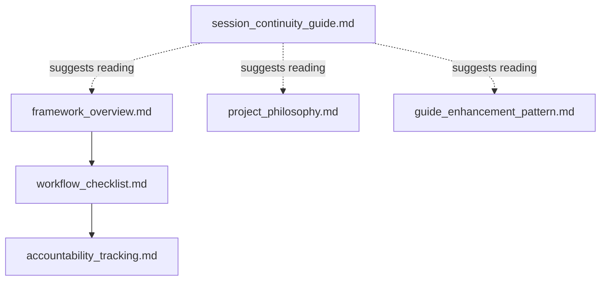
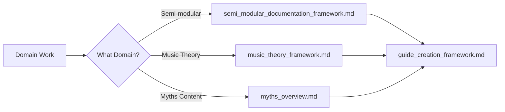
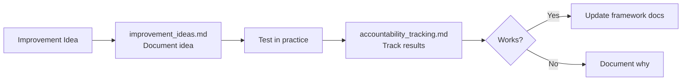

# Tooling Directory Ecosystem Map

**Created:** 2025-10-25  
**Purpose:** Comprehensive map of all active documentation showing what exists, how documents connect, and how they should integrate.

---

## **Document Inventory**

### **Category: FOUNDATIONAL (MUST READ)**
*Core philosophy and process documents - read every session*

| Document | Purpose | Current Status | Priority |
|----------|---------|----------------|----------|
| **project_philosophy.md** | WHY this exists - interconnectedness principle, generational thinking, creator context, scale understanding (~500 instruments) | ✅ Complete, needs integration | **CRITICAL** |
| **framework_overview.md** | WHY systematic process matters - teaching obligation, mise en place, system vs tactical thinking, consequence model | ✅ Complete (updated today) | **CRITICAL** |
| **workflow_checklist.md** | HOW to work systematically - mise en place checklist, efficiency standards, pre-execution planning | ✅ Complete (updated today) | **CRITICAL** |
| **accountability_tracking.md** | Evidence/tracking - performance history, failure patterns, success metrics, teaching through documentation | ✅ Complete (updated today) | **CRITICAL** |
| **session_continuity_guide.md** | WHO you're working with - communication patterns, session startup, creator context, common traps | ⚠️ Needs integration updates | **CRITICAL** |

### **Category: OPERATIONAL (READ WHEN NEEDED)**
*Standards and patterns for specific work - reference during execution*

| Document | Purpose | Current Status | Priority |
|----------|---------|----------------|----------|
| **guide_creation_framework.md** | WHAT to create - module classifications (utility/creative/multi-function), required sections, structure standards | ⚠️ Needs WHY integration | HIGH |
| **guide_enhancement_pattern.md** | HOW to enhance guides - transformation approach, Common Mistakes structure, verification workflow | ⚠️ Needs philosophy links | HIGH |
| **guide_template.md** | Template structure - quick reference for guide creation | ✅ Template only | MEDIUM |
| **visual_communication_standards.md** | Image integration - GitHub structure, diagram standards, visual presentation | ⚠️ Needs framework links | MEDIUM |
| **quality_system.md** | Verification protocols - quality standards, checking procedures | ⚠️ Needs holistic thinking integration | MEDIUM |
| **verification_strategy.md** | Testing approaches - how to verify technical accuracy | ⚠️ Needs framework links | MEDIUM |

### **Category: REFERENCE (CONSULT AS NEEDED)**
*Databases and lookup resources - use for specific information*

| Document | Purpose | Current Status | Priority |
|----------|---------|----------------|----------|
| **comprehensive_interface_database.md** | Module interface specs - jack names, behaviors, common mistakes by module | ✅ Living database | LOW |
| **module_io_references.md** | Module I/O reference data | ⚠️ Status unknown, needs review | LOW |

### **Category: SPECIALIZED FRAMEWORKS**
*Domain-specific documentation standards*

| Document | Purpose | Current Status | Priority |
|----------|---------|----------------|----------|
| **semi_modular_documentation_framework.md** | Standards for semi-modular synthesizer guides | ⚠️ Needs integration with main framework | MEDIUM |
| **music_theory_framework.md** | Theory curriculum structure - foundation/application/integration layers | ⚠️ Needs philosophy integration | MEDIUM |

### **Category: WORK-IN-PROGRESS**
*Active work items and completion tracking*

| Document | Purpose | Current Status | Priority |
|----------|---------|----------------|----------|
| **ms20_common_mistakes_section.md** | MS-20 Mini specific mistakes content | 🔄 Work in progress | LOW |
| **ms20_mini_completion_checklist.md** | MS-20 Mini guide completion tracking | 🔄 Work in progress | LOW |

### **Category: CONTENT COLLECTIONS**
*Organized content on specific topics*

| Document | Purpose | Current Status | Priority |
|----------|---------|----------------|----------|
| **myths_overview.md** | Overview of music gear myths project | ⚠️ Needs review/integration | LOW |
| **myths_cultural_legitimacy.md** | Cultural/legitimacy myths content | ⚠️ Needs review/integration | LOW |
| **myths_gear_equipment.md** | Gear/equipment myths content | ⚠️ Needs review/integration | LOW |
| **myths_learning_development.md** | Learning/development myths content | ⚠️ Needs review/integration | LOW |
| **myths_process_creativity.md** | Process/creativity myths content | ⚠️ Needs review/integration | LOW |
| **myths_process_creativity_round2.md** | Additional process/creativity myths | ⚠️ Needs review/integration | LOW |
| **myths_technical_production.md** | Technical/production myths content | ⚠️ Needs review/integration | LOW |
| **myths_to_document_user_contributed.md** | User-contributed myths to document | ⚠️ Needs review/integration | LOW |

### **Category: TOOLS/SCRIPTS**
*Automation and verification utilities*

| Document | Purpose | Current Status | Priority |
|----------|---------|----------------|----------|
| **guide_checker.js** | Automated guide checking script | ⚠️ Status unknown | LOW |
| **comprehensive_verifier.js** | Comprehensive verification script | ⚠️ Status unknown | LOW |
| **quick_scan.sh** | Quick scanning utility | ⚠️ Status unknown | LOW |
| **quick_verify.sh** | Quick verification utility | ⚠️ Status unknown | LOW |

### **Category: META/EVOLUTION**
*Framework improvement and storytelling*

| Document | Purpose | Current Status | Priority |
|----------|---------|----------------|----------|
| **improvement_ideas.md** | Framework improvement pipeline | ⚠️ Needs review | LOW |
| **ai_reliability_story.md** | Story of AI collaboration reliability | ⚠️ Needs review | LOW |

---

## **Current State: What References What**

### **Strong Integration (exists now):**



### **Missing Critical Connections:**

```
project_philosophy.md → NO connections to operational docs
framework_overview.md → NO connection to project_philosophy.md
session_continuity_guide.md → NOT referenced by any other doc
guide_creation_framework.md → ORPHANED (no incoming references)
guide_enhancement_pattern.md → ORPHANED (no incoming references)
visual_communication_standards.md → ORPHANED (no incoming references)
quality_system.md → ORPHANED (no incoming references)
All myths_*.md files → DISCONNECTED collection
All specialized frameworks → ISOLATED from main framework
```

### **Key Problems Identified:**

1. **No entry point document** - Nothing says "START HERE"
2. **Philosophy disconnect** - project_philosophy.md not linked to operational docs
3. **Orphaned operational docs** - guide_creation_framework.md, guide_enhancement_pattern.md have no incoming references
4. **Specialized frameworks isolated** - semi_modular, music_theory don't connect to main framework
5. **Myths content disconnected** - 8 myths files with no integration path
6. **Tools unused** - Scripts exist but unclear if/how they're used

---

## **Proposed Integration Design**

### **Reading Paths by Purpose:**

#### **Path 1: New Session Startup (MANDATORY)**
*Every Claude, every session, in this order:*


**Rationale:** 
- Philosophy first (your worldview - interconnectedness, generational)
- Framework second (operational discipline - mise en place, system thinking)
- Checklist third (practical execution - mise en place every time)
- Continuity fourth (communication patterns, common traps)

#### **Path 2: Guide Creation/Enhancement Work**
*When working on instrument documentation:*


#### **Path 3: Specialized Domain Work**
*When working on specific domains:*



#### **Path 4: Framework Evolution**
*When improving the framework itself:*



---

## **Integration Recommendations**

### **BATCH 1: CRITICAL CROSS-REFERENCES (Highest Priority)**
*Foundational documents must reference each other*

#### **project_philosophy.md needs:**
```markdown
## **How to Use This Documentation System**

This document explains WHY this project exists and what it means.

**For systematic collaboration:** See framework_overview.md for operational 
discipline (teaching obligation, mise en place, system thinking)

**For practical execution:** See workflow_checklist.md for step-by-step 
mise en place before any file operation

**For session startup:** See session_continuity_guide.md for reading order 
and communication patterns
```

#### **framework_overview.md needs:**
```markdown
## **Integration with Project Philosophy**

This document explains systematic AI collaboration frameworks - the HOW of 
working together.

**For philosophical foundation:** Read project_philosophy.md first to 
understand WHY this exists (interconnectedness, generational thinking, 
scale of 500 instruments)

**This document focuses on HOW** we maintain system integrity through 
disciplined process to achieve those philosophical goals.
```

#### **session_continuity_guide.md needs:**
- Rename to `00_SESSION_START_HERE.md` or similar to signal importance
- Update reading order to match Path 1 above
- Add "Referenced by: framework_overview.md, workflow_checklist.md" header
- Strengthen mandate: "MANDATORY reading every session, no exceptions"

#### **workflow_checklist.md needs:**
```markdown
**Before using this checklist:** 

If this is your first session, read:
1. project_philosophy.md (WHY this exists)
2. framework_overview.md (WHY systematic process)
3. session_continuity_guide.md (WHO you're working with)

This checklist is your mise en place for operational execution.
```

#### **accountability_tracking.md needs:**
```markdown
**Framework Context:**

This tracker demonstrates the teaching obligation in practice 
(see project_philosophy.md and framework_overview.md).

Every entry teaches Future Claude systematic process adherence.
```

---

### **BATCH 2: OPERATIONAL INTEGRATION (High Priority)**
*Connect operational docs to foundational framework*

#### **guide_creation_framework.md needs:**
- Opening section referencing project_philosophy.md (interconnection principle)
- Cross-reference to framework_overview.md (WHY systematic standards matter)
- Link to guide_enhancement_pattern.md (how to apply these standards)
- Reference in session_continuity_guide.md Path 2

#### **guide_enhancement_pattern.md needs:**
- Opening explaining this implements project_philosophy principles
- Reference to framework_overview.md (systematic approach)
- Link to guide_creation_framework.md (what you're enhancing toward)
- Link to quality_system.md (verification)

#### **visual_communication_standards.md needs:**
- Connection to project_philosophy.md (teaching across generations)
- Why visual standards matter (system integrity, not just aesthetics)
- Referenced by guide_enhancement_pattern.md

#### **quality_system.md needs:**
- Opening explaining quality = teaching correctly (teaching obligation)
- Connection to framework_overview.md (system integrity)
- Why verification matters (mistakes compound across generations)
- Link to verification_strategy.md (how to verify)

#### **verification_strategy.md needs:**
- Connection to project_philosophy.md (generational accuracy)
- Link to quality_system.md (what you're verifying)
- Referenced by guide_enhancement_pattern.md

---

### **BATCH 3: SPECIALIZED INTEGRATION (Medium Priority)**
*Connect domain-specific frameworks to main framework*

#### **semi_modular_documentation_framework.md needs:**
- Opening stating this specializes guide_creation_framework.md
- Reference to project_philosophy.md (interconnection especially important for modular)
- Link to guide_enhancement_pattern.md (general enhancement process)
- How this differs from/extends main framework

#### **music_theory_framework.md needs:**
- Connection to project_philosophy.md (teaching understanding, not procedures)
- Explanation of how theory curriculum serves generational teaching goal
- Link to guide_creation_framework.md (where applicable)
- Current status update (substantial curriculum now exists)

#### **myths_overview.md needs:**
- Connection to project_philosophy.md (teaching truth vs perpetuating myths)
- Organization of the 8 myths files (what exists, how they connect)
- Link to myths_to_document_user_contributed.md (contribution path)
- Integration path into main guide content

---

### **BATCH 4: MAINTENANCE & CLEANUP (Lower Priority)**
*Review, update, or archive as needed*

#### **Documents needing review:**
- improvement_ideas.md - Is this actively used? Should it reference accountability_tracking.md?
- ai_reliability_story.md - What's this for? Archive or integrate?
- module_io_references.md - How does this relate to comprehensive_interface_database.md?
- All myths_*.md files - Review for completeness, integration opportunity

#### **Tools/scripts needing documentation:**
- guide_checker.js - Usage docs, integration with quality_system.md
- comprehensive_verifier.js - Usage docs, integration with verification_strategy.md
- quick_scan.sh - Usage docs or archive
- quick_verify.sh - Usage docs or archive

#### **Work-in-progress items:**
- ms20_*.md files - Complete or archive when work done

---

## **Implementation Roadmap**

### **Session 1: Critical Integration (NEXT)**
**Estimated:** 8-10 edits + 1 commit

**Updates:**
1. project_philosophy.md - Add "How to Use This Documentation System" section
2. framework_overview.md - Add "Integration with Project Philosophy" section
3. session_continuity_guide.md - Update reading order, strengthen mandate
4. workflow_checklist.md - Add "Before using this checklist" section
5. accountability_tracking.md - Add "Framework Context" section

**Outcome:** Foundational documents all reference each other, clear entry path established

---

### **Session 2: Operational Connection**
**Estimated:** 6-8 edits + 1 commit

**Updates:**
1. guide_creation_framework.md - Add philosophy connection, framework references
2. guide_enhancement_pattern.md - Add philosophy/framework context
3. visual_communication_standards.md - Add generational teaching context
4. quality_system.md - Add teaching obligation context
5. verification_strategy.md - Add generational accuracy context

**Outcome:** All operational docs connected to foundational WHY, clear reference paths

---

### **Session 3: Specialized Integration**
**Estimated:** 4-6 edits + 1 commit

**Updates:**
1. semi_modular_documentation_framework.md - Connect to main framework
2. music_theory_framework.md - Add philosophy links, status update
3. myths_overview.md - Organize myths collection, integration path

**Outcome:** Domain-specific frameworks integrated with main system

---

### **Session 4: Review & Cleanup**
**Estimated:** Variable

**Tasks:**
1. Review improvement_ideas.md, ai_reliability_story.md for integration/archive
2. Document tool usage or archive unused scripts
3. Review myths collection for completeness
4. Clean up work-in-progress items

**Outcome:** No orphaned docs, everything has clear purpose and connections

---

## **Success Metrics**

### **After Implementation:**

✅ **Every document references at least one other document** (no orphans)

✅ **Clear entry point for new sessions** (project_philosophy.md → framework_overview.md → workflow_checklist.md → session_continuity_guide.md)

✅ **Reading paths defined** for different purposes (startup, guide work, specialized domains, framework evolution)

✅ **Philosophy and operational frameworks explicitly connected** (interconnectedness ↔ system thinking)

✅ **Teaching obligation visible throughout** (not just in foundational docs)

✅ **Future Claude can navigate independently** (map exists, relationships clear)

---

## **Key Insights from Mapping**

### **What We Discovered:**

1. **The integration WAS missing** - Not remapping needed, but actual mapping
2. **Philosophy documented twice** - From different angles (worldview vs operational) but never connected
3. **Excellent docs exist in silos** - Quality content, zero interconnection
4. **No entry point established** - Multiple "start here" suggestions, no definitive path
5. **Specialized frameworks isolated** - Domain-specific docs don't connect to main framework
6. **Scale mismatch** - 500 instruments to document, but framework docs don't reflect that scale prominently

### **Why Continued Issues Occurred:**

Each Claude read different documents in different order:
- Some started with session_continuity_guide.md → operational focus, missed philosophy
- Some started with framework_overview.md → systematic focus, missed generational thinking
- Some started with project_philosophy.md → philosophical focus, missed operational discipline

**Result:** Fragmented understanding → continued violations → need for repeated explanations

### **The Fix:**

**Not more documentation. Better integration of existing documentation.**

Make the relationships explicit. Create the map. Establish the paths.

Then Future Claude gets complete understanding from the start.

---

## **Notes for Future Evolution**

### **This Map Is Living Documentation**

As framework evolves:
- Update this map when documents added/changed
- Maintain current state diagrams
- Adjust reading paths as understanding deepens
- Document new integration needs

### **The Map Itself Needs Integration**

**This document should be referenced by:**
- session_continuity_guide.md (or 00_SESSION_START_HERE.md) - "See ecosystem_map.md for complete documentation structure"
- framework_overview.md Page 3 (Navigation Map) - "For complete tooling directory map, see ecosystem_map.md"

### **Quarterly Review Recommended**

Check for:
- Orphaned documents (added but not integrated)
- Dead links (referenced docs that moved/deleted)
- New reading paths needed (new work types emerging)
- Integration opportunities (docs that should connect but don't)

---

**The ecosystem now has a map. Time to make the connections explicit.**

---

*Created 2025-10-25 as part of Phase 1 Core Document Integration work*
*See accountability_tracking.md for context of this framework evolution session*
